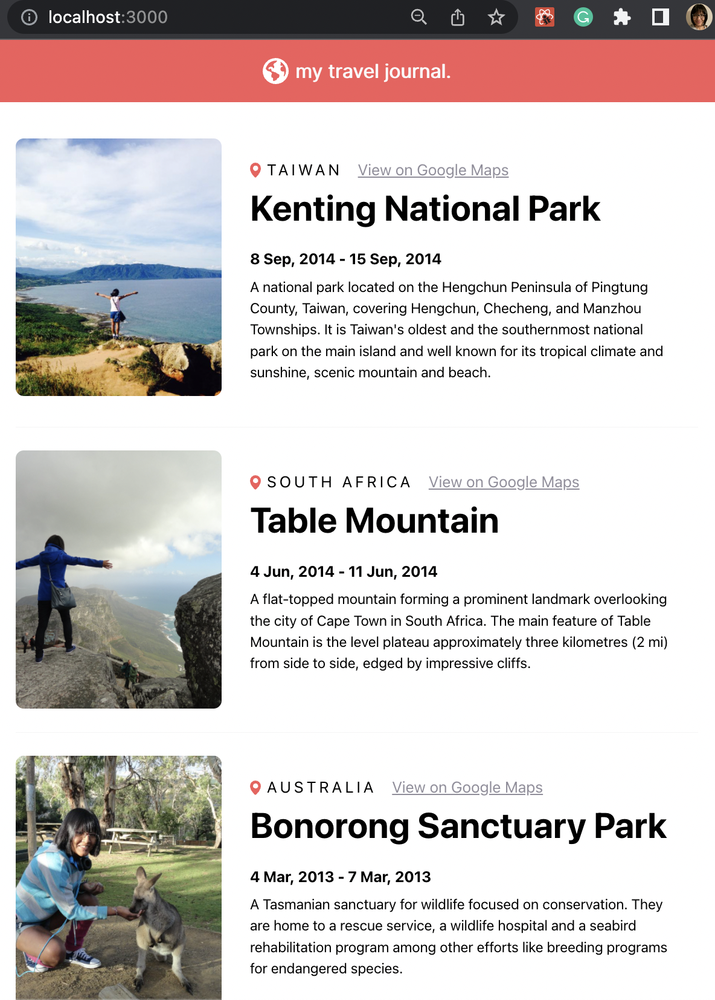
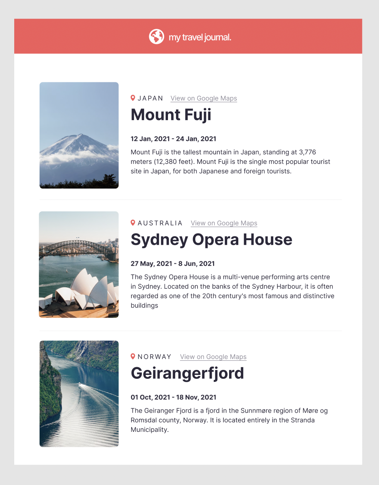

# React exercise-2: Travel Journal

Another react exercise: build a simple travel journal, following the Figma design provided by Scrimba. Practicing using props instead of hardcoded data.

## Getting Started

### `npm start`

Runs the app in the development mode.\
Open [http://localhost:3000](http://localhost:3000) to view it in your browser.

The page will reload when you make changes.\
You may also see any lint errors in the console.

## Available Scripts

In the project directory, you can run:
### `npm test`

Launches the test runner in the interactive watch mode.\
See the section about [running tests](https://facebook.github.io/create-react-app/docs/running-tests) for more information.

## How my journal looks like

### The Figma design from Scrimba

